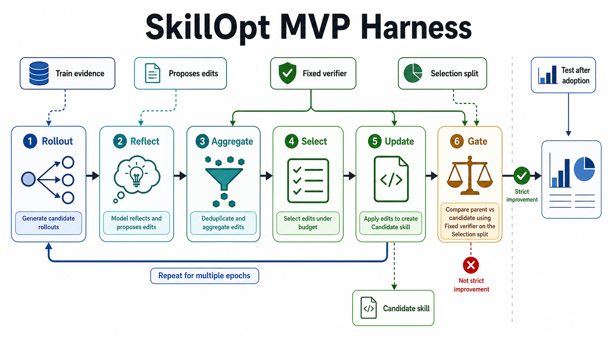

# SkillOpt MVP Harness

Languages: English | [한국어](README.ko.md) | [日本語](README.ja.md)



This repository is a minimal, manual harness for validating SkillOpt-style
skill improvement loops. It is not an optimizer, and it does not call Codex.
Its job is to make the experimental boundary boring and inspectable: prepare
tasks, run a fixed verifier, record pass/fail scores, preserve loop artifacts,
and gate candidate skills only when the evidence shows strict improvement.

The MVP focuses on two practical tracks:

- `code_repair`: small pytest-backed repair tasks.
- `data_normalization`: small pytest-backed cleanup and transformation tasks.

The Python harness owns the experimental mechanics. Codex, human judgment, and
any optimizer reflection happen outside the harness and produce files that the
harness can later record, aggregate, and gate.

## Why This Exists

Skill improvement is easy to fool yourself about. A candidate instruction can
look better because it saw the wrong split, because the parent and candidate
were not evaluated on the same tasks, because hidden tests leaked into the
working context, or because the baseline was quietly overwritten during the
experiment. The MVP exists to keep those failure modes visible.

The harness therefore treats a skill update as an evidence problem rather than
a prompt-writing problem:

- Train evidence may motivate candidate edits.
- Selection evidence decides whether the candidate is accepted.
- Test evidence is reserved for final reporting after adoption.
- The initial experiment baseline is immutable.
- The loop parent is the current best skill at the start of that loop.
- A candidate is accepted only if it strictly beats the parent on the same
  selection tasks.
- A contaminated loop is rejected even if the score improved.

The score is intentionally simple: verifier return code `0` is `1.0`; failure
or timeout is `0.0`. The interesting part of the MVP is not score modeling. It
is whether the loop discipline can be made explicit enough to audit.

## MVP Scenario

A clean single-loop experiment is expected to look like this:

1. Start from an initial baseline skill and snapshot it into the experiment.
2. Prepare train tasks and run external target-model rollouts with the parent
   skill.
3. Reflect on train failures outside the harness and write proposed skill edits.
4. Let the harness aggregate and select a small edit set within an edit budget.
5. Apply the selected edits to the loop parent to create a candidate skill.
6. Independently evaluate the parent and candidate on the same selection tasks.
7. Run the gate with the selection records and a non-unknown rollout isolation
   claim.
8. Accept the candidate only on strict selection improvement and clean split
   discipline.

For multi-epoch experiments, the same loop repeats for 2 to 4 epochs. Accepted
candidates update `current-best.md`, which becomes the next epoch's parent.
The original `initial-baseline.md` remains unchanged so the experiment can
always distinguish the starting point from accumulated improvements.

## Validation Protocol

The harness validates three separate surfaces.

### Task Isolation

`prepare-task` copies a fixture into a workspace without `tests_hidden`. The
workspace receives `.skillopt-task.json`, which records the track, split, task
id, description, entrypoint, and source fixture path. This metadata lets
`grade-task` restore hidden tests only inside a temporary grading workspace.

Prepared workspaces are therefore suitable for manual repair or rollout work:
visible tests can guide the attempt, but hidden tests are not exposed in the
workspace that the model or human edits.

### Fixed Verifier

Each track uses the configured pytest command from `skillopt.yaml`:

```yaml
evaluator_command:
  - uv
  - run
  - pytest
  - -q
  - tests_visible
  - tests_hidden
```

`grade-task` runs that verifier with a timeout and records stdout, stderr,
return code, timeout status, task metadata, and binary score. The verifier is
kept fixed for a grading run; changing tests or evaluator behavior to improve a
score is outside the contract unless the task is explicitly fixture
maintenance.

### Loop Gate

`loop-run` does not generate rollouts or ask a model for edits. It consumes
external artifacts:

- train rollout records;
- reflected edit proposals;
- parent selection records;
- candidate selection records;
- optional best selection records;
- contamination and rollout-isolation declarations.

The gate rejects a candidate when any of these are true:

- the loop is marked contaminated;
- rollout isolation is `unknown`;
- parent and candidate were not evaluated on the same selection task ids;
- candidate selection score is less than or equal to parent selection score.

If the candidate beats the parent but not the recorded best, it may update
`current-best.md`. If it beats both parent and best, it also updates
`best-skill.md`. The gate writes `gate-decision.json` and `decision.md` so the
reason for acceptance or rejection is reviewable after the fact.

## Artifact Model

The important skill-loop files are experiment-local, not hidden in application
state:

- `initial-baseline.md`: immutable skill snapshot for the experiment.
- `current-best.md`: accepted skill used as the next loop parent.
- `best-skill.md`: best accepted skill by recorded selection score.
- `<loop-id>/parent-skill.md`: parent snapshot for this loop.
- `<loop-id>/candidate-skill.md`: candidate produced by selected edits.
- `<loop-id>/rollouts/`: copied train rollout evidence.
- `<loop-id>/reflected-edits.json`: copied external edit proposals.
- `<loop-id>/aggregated-edits.json`: deduplicated edit candidates.
- `<loop-id>/selected-edits.json`: edit set chosen within budget.
- `<loop-id>/update-report.json`: edit application result.
- `<loop-id>/parent-selection.jsonl`: parent selection evaluation records.
- `<loop-id>/candidate-selection.jsonl`: candidate selection evaluation records.
- `<loop-id>/gate-decision.json`: machine-readable accept/reject decision.
- `<loop-id>/decision.md`: human-readable gate summary.
- `<loop-id>/full-loop-manifest.json`: complete loop manifest.

This file layout is deliberately plain. A reviewer should be able to inspect an
experiment directory and reconstruct what evidence was used, which skill was
edited, what changed, and why the candidate did or did not pass the gate.

## Current Skills And Baselines

Project-local Codex assets are manual inputs to the process, not Python harness
dependencies:

- `.codex/skills/code-repair/SKILL.md`
- `.codex/skills/data-normalization/SKILL.md`
- `.codex/skills/skillopt-loop/SKILL.md`
- `.codex/subagents/skill-loop-auditor.md`

Reusable weak baselines for MVP loop-validation experiments live in:

- `examples/baselines/code-repair-weak-baseline.md`
- `examples/baselines/data-normalization-weak-baseline.md`

These assets are useful for running experiments, but the harness should remain
manual: it must not call Codex or any optimizer model.

## Minimal Workflow Reference

The commands below are reference points for the validation protocol above, not
the purpose of the repository.

List and prepare a task:

```bash
uv run skillopt-harness list-tasks --track code_repair --split train
uv run skillopt-harness prepare-task \
  --track code_repair \
  --task train-expression-evaluator \
  --split train \
  --output workspaces/code_repair/train-expression-evaluator
```

After manually repairing or rolling out against the prepared workspace, grade
with the fixed verifier:

```bash
uv run skillopt-harness grade-task \
  --track code_repair \
  --workspace workspaces/code_repair/train-expression-evaluator \
  --output runs/code-repair-manual.jsonl
```

Run the gate after external rollout, reflection, and selection-evaluation
artifacts already exist:

```bash
uv run skillopt-harness loop-run \
  --track code_repair \
  --experiment-dir runs/my-experiment \
  --loop-id loop-01 \
  --initial-skill .codex/skills/code-repair/SKILL.md \
  --rollout-records runs/my-experiment/loop-01/train-rollouts.jsonl \
  --edit-proposals runs/my-experiment/loop-01/edit-proposals.json \
  --edit-budget 2 \
  --parent-selection-records runs/my-experiment/loop-01/parent-selection.jsonl \
  --candidate-selection-records runs/my-experiment/loop-01/candidate-selection.jsonl \
  --rollout-isolation independent
```

Abort early when split discipline was violated before a candidate should be
considered:

```bash
uv run skillopt-harness loop-abort \
  --track code_repair \
  --experiment-dir runs/my-experiment \
  --loop-id loop-01 \
  --initial-skill .codex/skills/code-repair/SKILL.md \
  --contamination-reason "selection results were visible during train reflection"
```

Run a 2 to 4 epoch series from already prepared epoch inputs:

```bash
uv run skillopt-harness epoch-run \
  --track code_repair \
  --experiment-dir runs/my-experiment \
  --initial-skill .codex/skills/code-repair/SKILL.md \
  --epoch-inputs runs/my-experiment/epoch-inputs.json \
  --edit-budget 2
```

## Development Checks

Before handing off code or artifact changes, run:

```bash
uv run pytest
uv run ruff check .
```

Task equivalents are available for the same workflow:

```bash
task init
task list TRACK=code_repair SPLIT=train
task prepare TRACK=code_repair TASK=train-expression-evaluator
task grade TRACK=code_repair TASK=train-expression-evaluator
task loop-run
task epoch-run
task check
```
